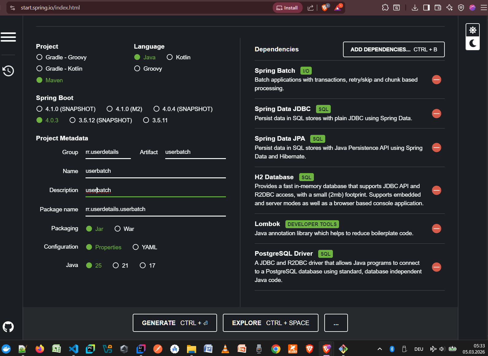

# feedback-sentiment-analysis-and-user-detail-validation-ai-data-pipeline
feedback sentiment analysis and user detail validation: AI data pipeline with Spring, OLLAMA, Falcons AI, JUnit and more

# Technical Documentation
The documentaion here is continually being updated, so kindly bear with the development saga. The code, however, is the ultimate "source of truth".

The project dependencies of User Batch:
- 

## References
- [Spring Batch 6.0 Migration Guide · spring-projects/spring-batch Wiki](https://github.com/spring-projects/spring-batch/wiki/Spring-Batch-6.0-Migration-Guide)
