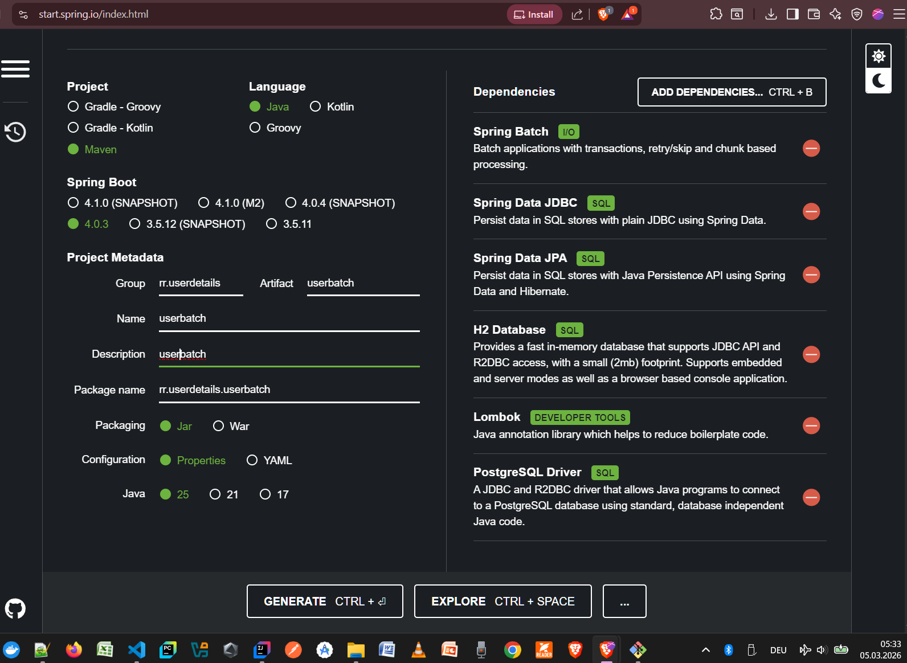

# Feedback Sentiment Analysis and User Detail Validation: AI Data Pipeline
Feedback sentiment analysis and user detail validation
- AI-ready data pipeline with Spring, OLLAMA, Falcons AI and JUnit

# Technical Documentation
The documentaion here is continually being updated, so kindly bear with the continuous improvement practice. The code is always the ultimate "source of truth".

The project dependencies of User Batch:
- 

## References
- [Spring Batch 6.0 Migration Guide · spring-projects/spring-batch Wiki](https://github.com/spring-projects/spring-batch/wiki/Spring-Batch-6.0-Migration-Guide)
